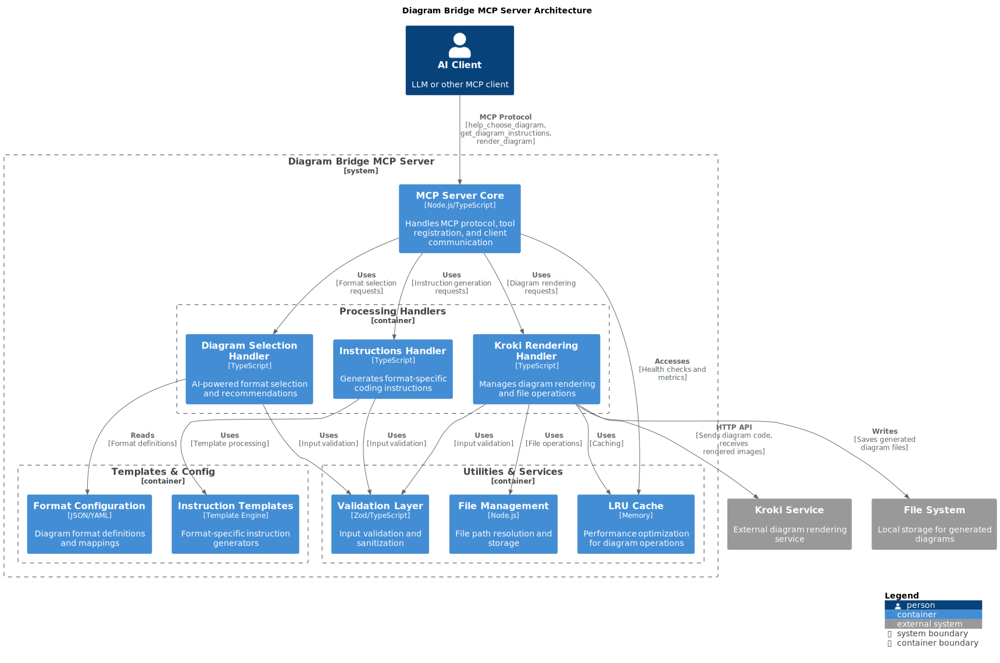

# Architecture Documentation

## System Architecture

The Diagram Bridge MCP Server follows a clean, modular architecture designed for scalability and maintainability. The server uses a pipeline approach with specialized handlers for format selection, instruction generation, and rendering operations.

*This C4 Container diagram shows the complete system architecture, from MCP protocol handling through to diagram rendering.*

## Key Components

### 1. MCP Server Core
- **Technology**: Node.js/TypeScript
- **Purpose**: Handles MCP protocol communication, tool registration, and client requests
- **Tools Exposed**: 
  - `help_choose_diagram` - AI-powered format selection
  - `get_diagram_instructions` - Format-specific coding instructions
  - `render_diagram` - Complete diagram rendering

### 2. Processing Handlers
- **Diagram Selection Handler**: Uses AI heuristics to recommend optimal diagram formats
- **Instructions Handler**: Generates format-specific coding instructions for LLMs
- **Kroki Rendering Handler**: Manages diagram rendering through external Kroki service

### 3. Utilities & Services
- **Validation Layer**: Zod-based input validation and sanitization
- **LRU Cache**: Performance optimization for diagram operations
- **File Management**: File path resolution and storage operations

### 4. Templates & Configuration
- **Format Configuration**: Diagram format definitions and capability mappings
- **Instruction Templates**: Template engine for generating format-specific instructions

### 5. External Dependencies
- **Kroki Service**: External service for high-quality diagram rendering
- **File System**: Local storage for generated diagram files

## Data Flow

1. **AI Client Request**: AI client sends MCP requests to the server
2. **Request Routing**: MCP Server Core routes requests to appropriate handlers
3. **Processing**: Handlers utilize validation, caching, and configuration services
4. **External Rendering**: For rendering, the server communicates with external Kroki service
5. **File Storage**: Generated diagrams are saved to local file system
6. **Response**: Results are returned to the client via MCP protocol

## Architecture Benefits

### Separation of Concerns
Clear boundaries between protocol handling, processing, and utilities enable:
- Independent component development
- Easier testing and debugging
- Reduced coupling between components

### Extensibility
- Easy to add new diagram formats or handlers
- Plugin-like architecture for new features
- Configurable format definitions

### Performance
- LRU caching for diagram rendering operations
- Efficient file management and storage
- Optimized template rendering pipeline

### Reliability
- Comprehensive validation and error handling
- Retry logic with exponential backoff
- Health monitoring and metrics collection

### Maintainability
- TypeScript with clear component interfaces
- Consistent code patterns and conventions
- Comprehensive test coverage

## Component Details

### Format Selection Pipeline
1. **Request Analysis**: Analyze user request using keyword-based heuristics
2. **Format Scoring**: Each format receives confidence score based on analysis
3. **Recommendation Generation**: Create structured prompt with recommendations
4. **LLM Integration**: Provide comprehensive format knowledge for decision-making

### Instruction Generation Pipeline
1. **Format Validation**: Ensure requested format is supported
2. **Template Selection**: Select appropriate instruction template
3. **Context Integration**: Incorporate user request context
4. **Prompt Assembly**: Generate complete instruction prompt

### Diagram Rendering Pipeline
1. **Input Validation**: Validate diagram code and format
2. **Cache Check**: Check LRU cache for existing renders
3. **Kroki Communication**: Send request to Kroki service
4. **File Storage**: Save rendered diagram to file system
5. **Response Assembly**: Return file paths and metadata

## Design Patterns

### Pipeline Architecture
Sequential processing of diagram workflow with clear stages and handoffs.

### Resource Pattern
MCP resource management for health checks, metrics, and catalog information.

### Template Engine
Dynamic prompt generation system for creating format-specific instructions.

### Caching Layer
LRU cache implementation for performance optimization of rendering operations.

### Handler Pattern
Specialized handlers for different types of operations (selection, instructions, rendering).

## Technology Stack

### Core Technologies
- **Node.js**: Runtime environment
- **TypeScript**: Type safety and development experience
- **Zod**: Schema validation and type inference
- **LRU Cache**: Performance optimization

### External Services
- **Kroki**: Professional diagram rendering service
- **Docker**: Containerization and local service orchestration

### Development Tools
- **Jest**: Testing framework
- **ESLint**: Code quality and consistency
- **Docker Compose**: Local development environment

## Scalability Considerations

### Horizontal Scaling
- Stateless design enables horizontal scaling
- Shared storage for generated files
- Load balancer compatibility

### Resource Management
- Efficient memory usage patterns
- CPU optimization for non-blocking operations
- Automatic cleanup of old generated files

### Performance Monitoring
- Real-time metrics collection
- Health check endpoints
- Performance bottleneck identification
