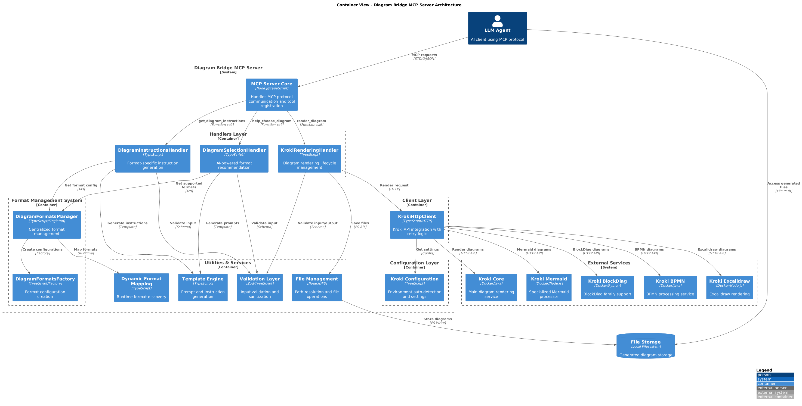

# Architecture Documentation

## Overview

Diagram Bridge MCP Server is a modern architectural bridge between LLM agents and professional diagram creation. The system implements a modular architecture with clear separation of concerns and support for 10+ diagram formats through integration with the Kroki service.



*C4 Container diagram shows the complete system architecture from MCP protocol handling to diagram rendering.*

## Architectural Principles

### 1. Modular Architecture
- **Layered organization**: clear separation into protocol, business logic, and infrastructure layers
- **Dependency inversion**: dependencies directed from concrete implementations to abstractions
- **Single responsibility**: each component has a clearly defined role

### 2. Configurability
- **Dynamic format discovery**: automatic registration of supported formats
- **Factory pattern**: centralized creation of format configurations
- **Format manager**: single point of control for all diagram formats

### 3. Extensibility
- **Plugin architecture**: simple addition of new diagram formats
- **Template Engine**: flexible template system for instruction generation
- **Configuration layer**: ability to configure without code changes

## Key Components

### 1. MCP Server Core (`src/index.ts`)
**Role**: Central entry point and MCP protocol management
- **Technologies**: Node.js 18+, TypeScript, @modelcontextprotocol/sdk
- **MCP Tools**:
  - `help_choose_diagram` - AI analysis and optimal format recommendation
  - `get_diagram_instructions` - Generation of format-specific instructions
  - `render_diagram` - Professional diagram rendering
- **Architectural role**: Facade pattern for all MCP operations

### 2. Handlers Layer

#### DiagramSelectionHandler (`src/resources/diagram-selection-handler.ts`)
- **Purpose**: Intelligent diagram format recommendation
- **Technologies**: AI heuristics, pattern analysis, templating
- **Dependencies**: FormatSelectionAnalyzer, DiagramSelectionPromptTemplate, DiagramSelectionValidator

#### DiagramInstructionsHandler (`src/resources/diagram-instructions-handler.ts`)
- **Purpose**: Generation of format-specific instructions for LLM
- **Capabilities**: Contextual templates, syntax guidelines, code examples
- **Architectural pattern**: Template Method

#### KrokiRenderingHandler (`src/resources/kroki-rendering-handler.ts`)
- **Purpose**: Managing the diagram rendering lifecycle
- **Capabilities**: 
  - Kroki API integration
  - File system management
  - Error handling with retry logic
  - Output format validation
- **Architectural patterns**: Adapter (for Kroki API), Command (for rendering operations)

### 3. Format Management System

#### DiagramFormatsManager (`src/config/diagram-formats-manager.ts`)
- **Pattern**: Singleton
- **Role**: Centralized management of all diagram formats
- **Capabilities**:
  - Runtime discovery of supported formats
  - Management of enabled/disabled formats
  - MCP ↔ Kroki format mapping
  - Format-output combination validation

#### DiagramFormatsFactory (`src/config/diagram-formats-factory.ts`)
- **Pattern**: Factory Method + Builder
- **Supported formats**:
  - **Core**: Mermaid, PlantUML, D2, GraphViz
  - **Specialized**: BPMN, C4-PlantUML, Structurizr, Excalidraw, Vega-Lite
  - **Aliases**: c4, c4plantuml (for compatibility)
- **Configuration per format**:
  - Characteristics (strengths, weaknesses, bestFor)
  - Instruction templates (syntax, best practices, pitfalls)
  - Supported outputs (PNG/SVG)
  - Example code and file extensions

### 4. Client Layer

#### KrokiHttpClient (`src/clients/kroki-client.ts`)
- **Pattern**: Adapter + Strategy
- **Deployment strategy**: Local Docker Kroki priority, no cloud fallback
- **Capabilities**:
  - HTTP client with retry logic (exponential backoff)
  - Health checking
  - Configurable timeouts and retry attempts
  - Environment auto-detection (development vs production)

### 5. Utilities and Services

#### Validation Layer
- **Zod-based schemas**: type-safe validation of all input data
- **Multi-level validation**: input → business rules → output
- **Files**: `*-schema.ts`, `*-validation.ts`

#### Template Engine (`src/templates/`)
- **InstructionTemplate**: Generation of format-specific prompts
- **PromptTemplate**: Creation of structured prompts for format selection
- **Template variables**: Contextual value substitution

#### Dynamic Format Mapping (`src/utils/dynamic-format-mapping.ts`)
- **Purpose**: Runtime format discovery and mapping
- **Replaces**: Static configurations with dynamic ones
- **Integration**: With DiagramFormatsManager for consistency

#### File Management (`src/utils/file-path.ts`)
- **Capabilities**: Path resolution, directory creation, file naming
- **Strategy**: Timestamp-based unique file names
- **Storage**: `generated-diagrams/` in project root

### 6. Configuration Layer

#### Kroki Configuration (`src/config/kroki.ts`)
- **Environment auto-detection**: development vs Docker container
- **URL strategies**:
  - Development: `http://localhost:8000`
  - Docker: `http://kroki:8000`
  - Explicit: via `KROKI_URL` env var
- **Settings**: timeout, retry count, cloud fallback control

## Data Flow

### 1. Format Selection (help_choose_diagram)
```
Client Request → Input Validation → Explicit Format Detection → 
Heuristics Analysis → Template Generation → Structured Prompt Response
```

### 2. Instruction Generation (get_diagram_instructions)
```
Format + User Request → Format Validation → Template Selection → 
Context Integration → Instruction Assembly → Detailed Guide Response
```

### 3. Diagram Rendering (render_diagram)
```
Code + Format → Input Validation → Format-Output Validation → 
File Path Generation → Kroki API Call → File Storage → Response Assembly
```

## Integration with External Services

### Docker-compose Architecture
- **diagram-bridge-mcp**: Main MCP server
- **kroki**: Core rendering service
- **kroki-mermaid**: Specialized Mermaid processor
- **kroki-blockdiag**: BlockDiag family support
- **kroki-bpmn**: BPMN processing
- **kroki-excalidraw**: Excalidraw support

### Network Architecture
- **Internal network**: `diagram-network` for isolation
- **Health checks**: Automatic service readiness detection
- **Port mapping**: 3000 (MCP), 8000 (Kroki)

## Architectural Benefits

### Scalability
- **Stateless design**: Horizontal scaling without state
- **Modular architecture**: Independent component scaling
- **Docker-ready**: Containerization for cloud deployments
- **Resource optimization**: Efficient memory and CPU usage

### Reliability
- **Comprehensive error handling**: Graceful degradation on errors
- **Retry mechanisms**: Exponential backoff for external calls
- **Input validation**: Multi-layer data validation
- **Health monitoring**: Automatic service status detection

### Performance
- **Lazy loading**: On-demand configuration loading
- **Singleton patterns**: Manager instance reuse
- **Optimized file operations**: Batch operations and stream processing
- **Network optimization**: Keep-alive connections, connection pooling

### Maintainability
- **TypeScript**: Complete type safety throughout the project
- **Clean code patterns**: SOLID principles, DRY, KISS
- **Comprehensive testing**: Unit, integration, end-to-end tests
- **Documentation**: Auto-generated API documentation

## Technology Stack

### Core Technologies
- **Runtime**: Node.js 18+
- **Language**: TypeScript 5.8+
- **MCP SDK**: @modelcontextprotocol/sdk ^1.15.0
- **Validation**: Zod ^3.24.1
- **Process Management**: FlowMCP ^2.1.1

### Infrastructure
- **Containerization**: Docker + Docker Compose
- **Reverse Proxy**: Nginx (in production)
- **Service Discovery**: Docker internal networking
- **File Storage**: Local filesystem (with S3 extension capability)

### Development Tools
- **Testing**: Jest ^29.7.0 + ts-jest
- **Build**: TypeScript Compiler + custom scripts
- **Linting**: ESLint + Prettier
- **CI/CD**: GitHub Actions ready

## Design Patterns

### Architectural Patterns
1. **Layered Architecture**: Clear separation into presentation, business, data layers
2. **Pipeline Pattern**: Sequential processing of diagram workflow
3. **Factory Pattern**: Creation of format configurations
4. **Singleton Pattern**: DiagramFormatsManager for global state
5. **Template Method**: Instruction generation pipeline
6. **Adapter Pattern**: Kroki API integration
7. **Strategy Pattern**: Different rendering strategies

### Behavioral Patterns
1. **Command Pattern**: Encapsulation of rendering operations
2. **Observer Pattern**: Health monitoring and metrics collection
3. **Chain of Responsibility**: Validation pipeline
4. **Template Method**: Prompt generation workflow

## Security Considerations

### Input Validation
- **Schema validation**: Zod-based type checking
- **Sanitization**: XSS and injection prevention
- **Size limits**: Maximum code length controls
- **Rate limiting**: Request throttling (ready to add)

### Process Security
- **Non-root containers**: Security-first Docker images
- **Resource limits**: Memory and CPU constraints
- **Network isolation**: Internal Docker networks
- **Environment isolation**: Separate development/production configs

### Data Security
- **File system**: Controlled access to generated-diagrams
- **Temporary cleanup**: Automatic removal of old files
- **No sensitive data**: No personal data in logs

## Monitoring and Observability

### Health Checks
- **Application health**: MCP server status
- **Dependency health**: Kroki service availability
- **Resource health**: Memory, CPU, disk usage

### Logging Strategy
- **Structured logging**: JSON format for machine parsing
- **Log levels**: DEBUG, INFO, WARN, ERROR
- **Context preservation**: Request tracing through components

### Metrics Collection
- **Performance metrics**: Response times, throughput
- **Business metrics**: Format popularity, success rates
- **Infrastructure metrics**: Resource utilization

## Architecture Evolution Plans

### Short-term Improvements
1. **Caching Layer**: Redis for diagram caching
2. **API Gateway**: Rate limiting and authentication
3. **Service Mesh**: Istio for microservices communication
4. **Monitoring**: Prometheus + Grafana

### Long-term Evolution
1. **Microservices**: Separation into independent services
2. **Event-driven**: Asynchronous processing via message queue
3. **Multi-cloud**: Support for various cloud providers
4. **AI Integration**: More sophisticated AI models for format selection

## Deployment Architecture

### Development Environment
```
Local Machine → Docker Compose → Local Kroki → File System
```

### Production Environment
```
Load Balancer → MCP Server Cluster → Kroki Service Cluster → 
Shared Storage → Monitoring Stack
```

### Container Orchestration
- **Development**: Docker Compose
- **Production**: Kubernetes ready
- **Scaling**: Horizontal pod autoscaling
- **Service Discovery**: Kubernetes DNS

## Performance Characteristics

### Benchmarks
- **Format Selection**: < 100ms response time
- **Instruction Generation**: < 200ms response time  
- **Diagram Rendering**: < 5s for complex diagrams
- **Concurrent Requests**: 50+ simultaneous renders

### Resource Requirements
- **Memory**: 256MB - 1GB depending on load
- **CPU**: 0.5-2 cores for optimal performance
- **Storage**: 1GB+ for generated diagrams
- **Network**: 100Mbps+ for Kroki communication

---

*This architectural documentation reflects the current state (v1.0.0) and development plans for Diagram Bridge MCP Server. Documentation is updated with each major release.*
