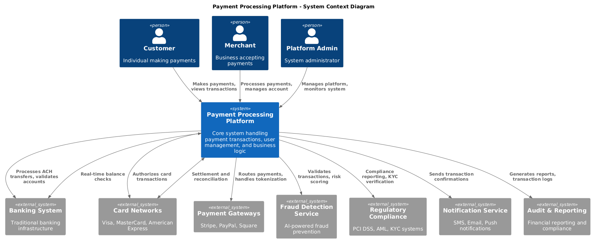

# Examples Gallery

This document showcases all available examples demonstrating the Diagram Bridge MCP Server capabilities. Each example includes a prompt and the generated diagram demonstrating different diagram formats and use cases.

## 📊 BPMN (Business Process Model and Notation)

### Order Approval Process
**Prompt:**
```
Choose the best diagram format for documenting the order approval process with tasks, gateways, and swimlanes between Sales, Manager, and Finance, then generate the diagram code and render it to an image file. Save the result as order_approval_bpmn
```

**Generated Diagram:**


**Use Case:** Business process documentation with swimlanes, tasks, and decision gateways

---

## 🏗️ C4 PlantUML (Architecture Documentation)

### CMS Container View
**Prompt:**
```
Choose the best diagram format for defining a workspace with container views for a content management system, including web app, API, and database containers, then generate the diagram code and render it to an image file. Save the result as cms_container_view
```

**Generated Diagram:**


**Use Case:** System architecture documentation using C4 model container views

---

## 🎯 D2 (Declarative Diagramming)

### E-commerce Microservices Architecture
**Prompt:**
```
Choose the best diagram format for showing a microservice-based e-commerce system architecture with services for user management, inventory, and payment, then generate the diagram code and render it to an image file. Save the result as ./diagrams2/ecommerce_microservices_architecture
```

**Generated Diagram:**


**Use Case:** Modern microservices architecture visualization with clean, declarative syntax

---

## ✏️ Excalidraw (Hand-drawn Style Diagrams)

### User Dashboard Wireframe
**Prompt:**
```
Choose the best diagram format for sketching a low-fidelity wireframe of a user dashboard page with sidebar navigation, a top bar containing search and profile icons, and a main metrics overview section, then generate the diagram code and render it to an image file. Save the result as user_dashboard_wireframe
```

**Generated Diagram:**


**Use Case:** UI/UX wireframes and mockups with hand-drawn aesthetic

---

## 🔗 GraphViz (Graph Visualization)

### Node.js Dependency Graph
**Prompt:**
```
Choose the best diagram format for representing the dependency graph of modules in a Node.js application, including packages, modules, and import relationships, then generate the diagram code and render it to an image file. Save the result as nodejs_dependency_graph
```

**Generated Diagram:**


**Use Case:** Dependency graphs, network topologies, and hierarchical structures

---

## 🌊 Mermaid (Flowcharts and Diagrams)

### User Authentication Flow
**Prompt:**
```
Choose the best diagram format for visualizing the user signup and login workflow including states and transitions, then generate the diagram code and render it to an image file. Save the result as user_auth_flow
```

**Generated Diagram:**


**Use Case:** State diagrams, flowcharts, and sequence diagrams

---

## 🌱 PlantUML (UML Diagrams)

### Blog System Class Diagram
**Prompt:**
```
Choose the best diagram format for illustrating the class relationships in a blogging system, including User, Post, and Comment classes with inheritance and associations, then generate the diagram code and render it to an image file. Save the result as blog_class_diagram
```

**Generated Diagram:**


**Use Case:** UML class diagrams, sequence diagrams, and component diagrams

---

## 🏛️ Structurizr (Architecture as Code)

### System Landscape
**Prompt:**
```
Choose the best diagram format for creating a system landscape diagram using architecture as code, then generate the diagram code and render it to an image file. Save the result as system_landscape_structurizr.png.
```

**Generated Diagram:**


**Use Case:** Enterprise architecture documentation with C4 model compliance

---

## 📈 Vega-Lite (Data Visualization)

### Sales Metrics Chart
**Prompt:**
```
Choose the best diagram format for visualizing monthly sales metrics as a combination of bar and line charts with interactive tooltips, then generate the diagram code and render it to an image file. Save the result as sales_metrics_chart
```

**Generated Diagram:**


**Use Case:** Data visualization, statistical charts, and interactive dashboards

---

## 🚀 How to Use These Examples

1. **Copy any prompt** from the examples above
2. **Paste it into your MCP client** (like Cursor)
3. **Watch the magic happen** as the system:
   - Analyzes your request
   - Chooses the optimal diagram format
   - Generates the diagram code
   - Renders it to a professional image

## 💡 Tips for Creating Your Own Prompts

- **Be specific** about what you want to visualize
- **Mention relationships** between components
- **Include context** about the domain (business process, software architecture, etc.)
- **Specify output preferences** if you have them
- **Let the system choose** the format for best results

## 🔄 Workflow Pattern

All examples follow this pattern:
```
Choose the best diagram format for [YOUR_REQUIREMENT], then generate the diagram code and render it to an image file. Save the result as [OUTPUT_NAME]
```

This single prompt triggers the complete workflow:
1. **Format Selection** (`help_choose_diagram`)
2. **Code Generation** (`get_diagram_instructions`)
3. **Professional Rendering** (`render_diagram`)

---

**Need more examples?** Check the [`examples/`](../examples/) directory for source files and generated diagrams.
